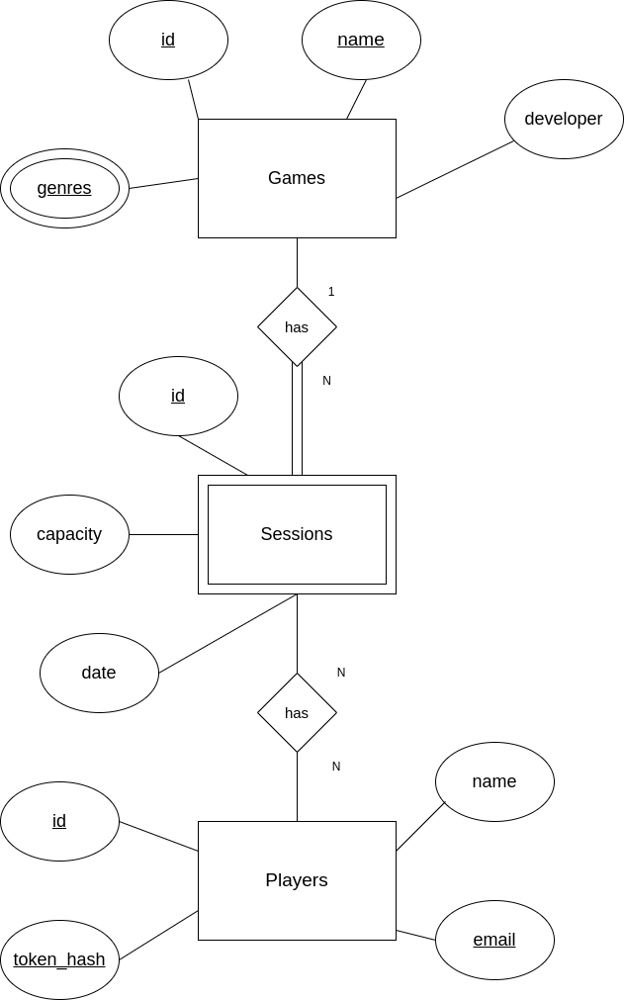

## Introduction

The project consists of the development of an application that allows management of multiplayer game sessions.

We implemented the backend of the application with `kotlin`,
`HTTP4K` library for the server and the `kotlinx.serialization` library for JSON serialization.  
We covered the implemented features with unit tests using the `JUnit` library.  
The database is managed by `PostgreSQL` and the connections are made using the `JDBC` library.

On the frontend side, we used Javascript modules to manage the user interface of the website.
The web application loads only a single web page document and updates its content via JavaScript making by HTTP requests to the server and 
replacing the page content with the content of the response.

This technique is called Single Page Application (SPA).

## Implementation Details

### Database

#### Conceptual model ###
The following diagram holds the Entity-Relationship model for the information managed by the system.

We highlight the following aspects:

In this model, we have 3 entities: Game, Player, and Session.

Each game has a unique identifier, a unique name, a developer and a set of genres.

Each player has a unique identifier, a unique name, a unique e-mail and a unique token hash for authentication.

Each session has a unique identifier, a capacity, and a date.

The relationships between the entities are as follows:
- A game can have multiple sessions. A session can only have one game associated (1 to N). A session has to have a game associated to it to exist.
- A player can be associated with multiple sessions. A session can have multiple players associated (N to N). A player does not have to be associated with a session to exist.
- A session does not have to have any players associated with it to exist.

The conceptual model has the following restrictions:
- Ids must be valid numbers.
- Genres must be valid strings and belong to a set of predefined genres.
- Names must be valid strings.
- Emails must follow a valid email format.
- Dates must follow a valid date format.
- Sessions must have a capacity greater than 0 and at most 100.
- Sessions must have a date in the future.
- To add a player to a session, the player must not already be in the session, the session must not be full and not closed
- To create a session, the current date must be after the session date.

#### Physical Model ###

The physical model of the database is available [here](../../../../../sql/createTables.sql).

We highlight the following aspects of this model:

The database has 3 tables: Games, Players, and Sessions.

In this model, a sessions_players table was created to represent the N to N relationship between players and sessions.
This table holds the foreign keys to the Players and Sessions tables, holding a Session-Player association pair in each row.
Additionally, the foreign key pair is defined as the primary key of the table, ensuring that a player can only be associated with a session once.

IDs were defined as serial primary keys. The Sessions table holds a foreign key to the Games table, representing the 1 to N relationship between games and sessions.

The genres defined as valid were 'Action', 'Adventure', 'RPG', 'Shooter', 'Turn-Based'.

Data Integrity restrictions mentioned in the conceptual model are enforced by the database by defining the proper types and constraints for each column.

The remaining restrictions mentioned in the conceptual model that are
not present in the physical model are enforced by the application logic at the service layer.

### Software organization

#### Request Details

#### Server Request Flow

At the Server level, the request is routed to the appropriate handler based on the path and method of the request.

The handler then processes the client's request at the API level of the application, 
which is responsible for validating the request parameters and checking for any errors.

After checking for errors, the handler calls the appropriate service method to process the request at the service level.
The service layer is responsible for handling the business logic of the application. 

It checks if the business rules of the
specific service are being followed and then calls the appropriate data access method to interact with the database.

The database then sanitizes the input with prepared statements to prevent SQL injection attacks and returns the query result
to the service layer, which then returns the result to the handler, who is responsible for returning the HTTP response.

Internally in a request, the application uses the following most relevant classes:
- DTOs: Responsible for holding the data of the request and response. Can be serialized to JSON and deserialized from JSON. 
- Domain classes: Represent the entities of the application. Used for checking business rules and constrictions.
- Data Access classes: Responsible for interacting with the database.
- API, Service, and Data Access classes: Responsible for handling the request at the API, service, and data access levels.

And the following methods:
- `processRequest`: This method is responsible for processing the request at the API level. 
It is the main handler of the API layer and is responsible for processing the request and catching
any errors that may occur at the application level.
- `authHandler`: This method is responsible for checking if the request is authorized. It calls the `processRequest` method if the request is authorized.
- API methods: These methods are responsible for processing the request at the API level. They are called by the `processRequest` method in callback and are responsible for validating the request parameters and checking for any errors.
- Service methods: These methods are responsible for processing the request at the service level. They are called by the API methods and are responsible for handling the business logic of the application.
- Data Access methods: These methods are responsible for interacting with the database. They are called by the service methods and are responsible for sanitizing the input with prepared statements to prevent SQL injection attacks and returning the query result to the service layer.

#### Client Request Flow

The requests of the frontend of the application use the Single Page Application (SPA) technique.

This technique allows the user interface to load only a single web page document and then update the body content
of that single document using DOM elements without making any additional HTTP browser requests.

The redirection of the user interface is done by replacing the body content of the document with the content of the
requested page.

The requested page URL is changed with a hash mark (#) on its path, which is then used to determine which content to
show on the page.

Whenever the page is first loaded, the `loadHandler` function is called to define the SPA routes.

The `loadHandler` function defines the routes of the SPA application and calls the `hashChangeHandler` function to load the content of the requested page.

The function `hashChangeHandler` is called whenever the hash mark of the URL changes, and it calls the `router` module to match the route and get the
correct handler.

The `router` module handles the route matching and URL query/parameter extraction logic of the SPA application.

The `handlers` module contains the functions that are called by the `router` module to load the content of the requested
page which contains DOM elements to be displayed.

#### Connection Management

The project manages connections to a PostgresSQL database through a class named `DBManager`. 

This class is extended by each of the database classes responsible for managing the data of the entities (Games, Players, and Sessions).

This class is responsible for giving out connections to the database for each thread, and closing them when they are no longer needed.
For each new connection, the class creates a new instance of a PGSimpleDataSource, and sets its connection parameters.
The connections are closed using the close method of the class.

In the overall application, at the `main` function, the application creates a new instance of the `SessionsDataManager` class. This 
class internally calls the `close` method for each of the database classes, implemented by the `DBManager` class, to close the connections.

When the `storage.use {}` block is finished, the `SessionsDataManager` internally calls the close method of the `DBConnectionManager` to close the connections.

#### Data Access

For data access, we implemented the `SessionsDataManager` class, which is responsible for managing storage, be it in memory or in a database.

We also implemented the `SessionsDataGame`, `SessionsDataPlayer`, and `SessionsDataSession` interfaces, which are responsible for managing the data of the respective entities and support different types of implementations, such as in-memory storage or database storage.

For the storage interface implementation, we created the `SessionsDataGameDB`, `SessionsDataPlayerDB`, and `SessionsDataSessionDB` classes for database storage,
and the `SessionsDataGameMem`, `SessionsDataPlayerMem`, and `SessionsDataSessionMem` classes for in-memory storage.

The database storage classes extend the `DBManager` class, which is responsible for managing the database connections for each thread and executing queries.

#### Error Handling/Processing

   #### Back-End 
As said in the Request Details section, the application processes the request at the API level, which is responsible for catching any errors and returning the appropriate response.

In case of incorrect request parametrization, the application catches the exception and returns a 400 Bad Request response. This is because the API layer is responsible for validating the request parameters and checking for any errors.

In case of a database error, the application catches the exception and returns a 500 Internal Server Error response. This is
because the service layer is responsible for handling the business logic of the application and so the database methods should not be expected
to throw exceptions.

To help with error handling for different types of errors, we created the `SessionsException` class, which is responsible for holding the status code, description, and cause of the error. This class is a throwable class
that can be extended by other classes in order to create custom exceptions and errors. These custom exceptions are then caught by the API layer and returned as an HTTP response.

These errors don't interrupt the application execution, as the application catches the exception and returns the appropriate HTTP response to the client.
   #### Front-End
The SPA application prevents the user from committing errors by using DOM and CSS to sanitize user input and validate the input fields before sending the request to the server.

If a Back-End error is relevant to the user, the application displays an error message to the user, informing them of the error.

An example would be if no results are found for a given search, the application informs the user that no results were found and that they should try again with different parameters.

## Open-API Specification

[Open-api Specification](open-api.json)

In our Open-API specification, we highlight the following aspects:

We have 3 groups of endpoints: Games, Players, and Sessions.

The types of request methods the api supports are :
- GET
- POST
- DELETE
- PATCH
- 
The Games group has 3 endpoints:
- Game Creation : POST /games
- Game Search : GET /games
- Game Search by id : GET /games/{id}

The Players group has 3 endpoints:

- Player Creation : POST /players
- Player Details : GET /players/{id}
- Player Search : GET /players
- Authenticate player : POST /players/auth

The Sessions group has 7 endpoints:
- Create Session : POST /sessions
- Update session : PATCH /sessions/{id}
- Delete session : DELETE /sessions/{id}
- Session Search : GET /sessions/{gid}/list
- Session Search by id : GET /sessions/{id}
- Add player to session : POST /sessions/{id}/players
- Remove player from session : DELETE /sessions/{id}/players/{pid}

Response codes are:

| Response Code           | Description           | Examples                           |
|-------------------------|-----------------------|------------------------------------|
| 200                     | OK                    | Player details returned            |
| 201                     | Created               | Create a Game                      |
| 204                     | No Content            | No results found for search        |
| 400                     | Bad Request           | Missing a parameter on the request |
| 404                     | Not Found             | Player not found                   |
| 500                     | Internal Server Error | An error in the server             |

## Single Page Application 

### SPA Operations 

The SPA offers the following operations to the user:
- Search for games
- Search for sessions
- Create a player
- Create a game
- Create a session
- Update a session
- Delete a session
- See the details of a player
- Add a player to a session
- Remove a player from a session

### SPA Navigation 

### SPA Authentication

For registering, the SPA sends a request to the API to create a player with a name and email. 
The API returns a token that is stored in the browser's session storage.

For logging in, the SPA sends a request to the API to get the player details by token.
The API returns the player details (email, name, id) and a token cookie if the token is valid.

For logging out, the SPA sends a request to the API to erase the token cookie.

## Critical Evaluation

No major defects were detected as of the time of writing this report.

In the next phase of the project, we plan to refactor the authentication approach to use passwords instead of tokens,
and to implement the remaining features of the application.

We also plan to increase test coverage by adding more unit tests to the application.
