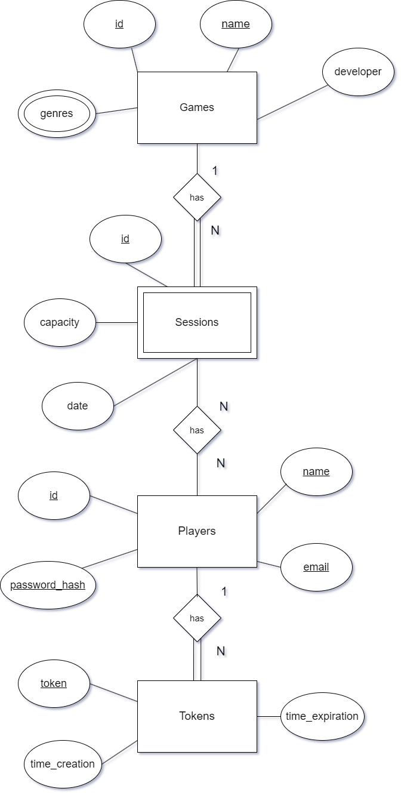
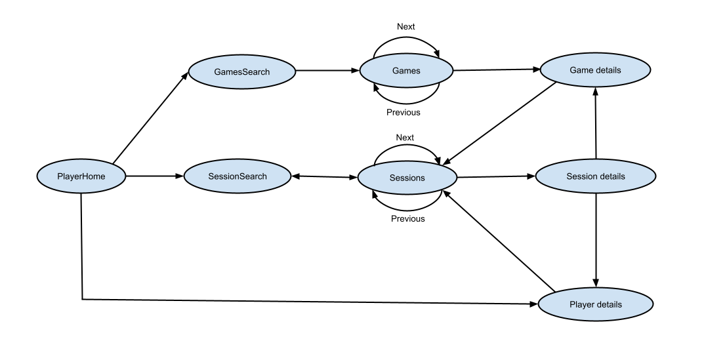

``## Introduction

The project consists of the development of an application that allows management of multiplayer game sessions.

The backend of the application was implemented with `kotlin`,
`HTTP4K` library for the server and the `kotlinx.serialization` library for JSON serialization.  
Automatic tests were implemented with `JUnit` for the operations the API provides.
The database is managed by `PostgreSQL` and the connections are made using the `JDBC` library.

On the frontend side, we used Javascript modules to manage the user interface of the website.
The web application loads only a single web page document and updates its content via JavaScript making by HTTP requests to the server and 
replacing the page content with the content of the response.

This design is called Single Page Application (SPA).

## Implementation Details

### Database

#### Conceptual model ###
The following diagram holds the Entity-Relationship model for the information managed by the system.



We highlight the following aspects:

In this model, we have 4 entities: Game, Player, Session, and Tokens.

Each game has a unique identifier, a unique name, a developer and a set of genres.

Each player has a unique identifier, a unique name, a unique e-mail and a unique token hash for authentication.

Each session has a unique identifier, a capacity, and a date, and is associated with a game and a set of players.

Each token has a unique UUID, an associated player, and a creation and expiration date.

The relationships between the entities are as follows:
- A game can have multiple sessions. A session can only have one game associated (1 to N). A session has to have a game associated to it to exist.
- A player can be associated with multiple sessions. A session can have multiple players associated (N to N). A player does not have to be associated with a session to exist.
- A session does not have to have any players associated with it to exist.
- A token must be associated with a player to exist. A player can have multiple tokens associated with it (1 to N).

The conceptual model has the following restrictions and business rules:
- Ids must be valid numbers.
- Genres must be valid strings and belong to a set of predefined genres.
- Names must be valid strings.
- Emails must follow a valid email format.
- Dates must follow a valid date format.
- Sessions must have a capacity greater than 0 and at most 100.
- Sessions must have a date in the future when created.
- To add a player to a session, the player must not already be in the session, the session must not be full and not closed.
- To remove a player from a session, the player must be in the session.
- To create a session, the current date must be after the session date.
- To create a player, the email or name must not be already in use.
- To create a game, the name must not be already in use.
- To update a session, the session must not be closed.

#### Physical Model ###

The physical model of the database is available [here](../../../../../sql/createTables.sql).

We highlight the following aspects of this model:

The database has 4 tables: Games, Players, Sessions, and Tokens.

In this model, a sessions_players table was created to represent the N to N relationship between players and sessions.
This table holds the foreign keys to the Players and Sessions tables, holding a Session-Player association pair in each row.
Additionally, the foreign key pair is defined as the primary key of the table, ensuring that a player can only be associated with a session once.

IDs were defined as serial primary keys. The Sessions table holds a foreign key to the Games table, representing the 1 to N relationship between games and sessions.

The genres defined as valid were 'Action', 'Adventure', 'RPG', 'Shooter', 'Turn-Based'.

Data Integrity restrictions mentioned in the conceptual model are enforced by the database by defining the proper types and constraints for each column.

Business rule restrictions, such as checking if a session is full or closed before adding a player are enforced by the application logic at the service layer.

### Software organization

#### Request Details

#### Server Request Flow

At the Server level, the request is routed to the appropriate handler based on the path and method of the request.

The handler then processes the client's request at the API level of the application, 
which is responsible for validating the request parameters and checking for any errors.

After checking for errors, the handler calls the appropriate service method to process the request at the service level.
The service layer is responsible for handling the business logic of the application. 

It checks if the business rules of the
specific service are being followed and then calls the appropriate data access method to interact with the database.

The database then sanitizes the input with prepared statements to prevent SQL injection attacks and returns the query result
to the service layer, which then returns the result to the handler, who is responsible for returning the HTTP response.

Internally in a request, the application uses the following most relevant classes:

- DTOs: Responsible for holding the data of the request and response. Can be serialized to JSON and deserialized from JSON.
- 
- Domain classes: Represent the entities of the application. Used for checking business rules and constrictions.

- API Class: Responsible for handling the request at the API level. Validates most of the request parameters and catches any errors that may occur in the application, 
returning the appropriate HTTP response.

- Service Classes: Responsible for handling the business logic of the application and executing transactions with the database. 
Also validates the request parameters not validated at the API level.

- Data Access Classes: Responsible for interacting with the database. Responsible for managing database connections and executing queries, returning them to the service layer.

And the following methods:
- `processRequest`: This method is responsible for processing the request at the API level. 
It is the main handler of the API layer and is responsible for processing the request and catching
any errors that may occur at the application level.
- `authHandler`: This method is responsible for checking if the request is authorized. It calls the `processRequest` method if the request is authorized.
- API methods: These methods are responsible for processing the request at the API level. They are called by the `processRequest` method in callback and are responsible for validating the request parameters and checking for any errors.
- Service methods: These methods are responsible for processing the request at the service level. They are called by the API methods and are responsible for handling the business logic of the application.
- Data Access methods: These methods are responsible for interacting with the database. They are called by the service methods and are responsible for sanitizing the input with prepared statements to prevent SQL injection attacks and returning the query result to the service layer.

#### Client Request Flow

The requests of the frontend of the application use the Single Page Application (SPA) technique.

This technique allows the user interface to load only a single web page document and then update the body content
of that single document using DOM elements without making any additional HTTP browser requests.

The redirection of the user interface is done by replacing the body content of the document with the content of the
requested page.

The requested page URL is changed with a hash mark (#) on its path, which is then used to determine which content to
show on the page.

Whenever the page is first loaded, the `loadHandler` function is called to define the SPA routes.

The `loadHandler` function defines the routes of the SPA application and calls the `hashChangeHandler` function to load the content of the requested page.

The function `hashChangeHandler` is called whenever the hash mark of the URL changes, and it calls the `router` module to match the route and get the
correct handler.

The `router` module handles the route matching and URL query/parameter extraction logic of the SPA application.

The `handlers` module contains the functions that are called by the `router` module to load the content of the requested
page which contains DOM elements to be displayed.

Each `handler` function is responsible for 'rendering' the content of the page by creating the necessary DOM elements and
replacing the body content of the document with the content of the page. Each handler calls a View method for the page to create the
DOM elements.

For this effect, a simple `web-dsl` module was created to help with the creation of the DOM elements. 
Each page of the SPA has its own implemented "View" method, which is responsible for creating the DOM elements of the page.
These page views also use "component" views to create the DOM elements of the components of the page. Components are reusable
DOM elements that are used in multiple pages of the SPA (e.g., Input fields, Buttons, etc.).

#### Connection Management

The project manages connections to a PostgresSQL database through a class named `TransactionManager`. 

This class is used by the Data Access classes to manage connections and transactions with the database.

Different connections are created for each thread that accesses the database. When a new transaction is started,
the TransactionManager checks if the thread already has a connection to the database. If it doesn't, a new connection is created.

For each new connection, the class creates a new instance of a PGSimpleDataSource, and sets its connection parameters.

Connections are closed for all threads when the `close` method of the `TransactionManager` class is called.

In the application, the `TransactionManager` class is used by the `SessionsDataManager` class to manage connections and transactions with the database. This 
storage management class implements the `Closeable` interface, by calling the `close` method of the `TransactionManager` class.

Whenever the [main](../SessionsServer.kt) `storage.use {}` block is finished, the `SessionsDataManager` internally calls the close method of the `TransactionManager` to close the connections.

#### Data Access

For data access, we implemented the `SessionsDataManager` class, which is an abstract class for managing the data of the entities (Games, Players, and Sessions)
and executing transactions. 

We also implemented the `SessionsDataGame`, `SessionsDataPlayer`, and `SessionsDataSession` interfaces, which are responsible for managing the data of the respective entities and support different types of implementations, such as in-memory storage or database storage.

For the storage interface implementation, we created the `SessionsDataGameDB`, `SessionsDataPlayerDB`, and `SessionsDataSessionDB` classes for database storage,
and the `SessionsDataGameMem`, `SessionsDataPlayerMem`, and `SessionsDataSessionMem` classes for in-memory storage. 

Memory storage classes extend the `MemoryStorage` class, which allows for the storage of data in memory and the ability to access different entities from the same storage class.

For database storage, a helper `TransactionManager` class was created to help manage connections and transactions with the database.

The `SessionsDataManager` class is extended and implemented by both the `DBManager` and `MemManager` classes, which use the 
different storage classes to manage the data of the entities, and implement different methods for executing transactions with the database.

The `DBManager` and `MemManager` classes are used as implementations of the `SessionsDataManager` class at the service layer of the application, and 
handle the data access and transactions with the database, by using all the described classes and methods.

#### Error Handling/Processing

#### Back-End 
As said in the Request Details section, the application processes the request at the API level, which is responsible for catching any errors and returning the appropriate response.

In case of incorrect request parametrization, the application catches the exception and returns a 400 Bad Request response. This is because the API layer is responsible for validating the request parameters and checking for any errors.

The service layer is responsible for enforcing the remaining business and data integrity rules, and catching any errors that may occur at the service level.
If the service layer catches an error, it throws an exception that is caught by the API layer, which then returns the appropriate HTTP response.

In case of a database error, the application catches the exception initially and initially tries handling the exception, checking for 
unique constraint and foreign key constraint violations, and then returns the appropriate HTTP response. 
If the exception can't be handled, the application returns a 500 Internal Server Error response.

To help with error handling for different types of errors, a `SessionsException` class was created, which is responsible for holding the status code, description, and cause of the error. This class is a throwable class
that can be extended by other classes in order to create custom exceptions and errors. These custom exceptions are then caught by the API layer and returned as an HTTP response.

These errors don't interrupt the application execution, as the API layer catches the exception and returns the appropriate HTTP response to the client.

#### Front-End
The SPA application prevents the user from committing errors by using DOM and CSS to sanitize user input and validate the input fields before sending the request to the server.

If a Back-End error is relevant to the user, the application displays an error message to the user, informing them of the error.

An example would be if no results are found for a given search, the application informs the user that no results were found and that they should try again with different parameters.

## Open-API Specification

[Open-api Specification](open-api.json)

In our Open-API specification, we highlight the following aspects:

We have 3 groups of endpoints: Games, Players, and Sessions.

The types of request methods the api supports are :
- GET
- POST
- DELETE
- PATCH

The Games group has 3 endpoints:
- Game Creation : POST /games
- Game Search : GET /games
- Game Search by id : GET /games/{id}

The Players group has 3 endpoints:

- Player Creation : POST /players
- Player Details : GET /players/{id}
- Player Search : GET /players
- Authenticate player : POST /auth
- Logout player : GET /logout

The Sessions group has 7 endpoints:
- Create Session : POST /sessions
- Update session : PATCH /sessions/{id}
- Delete session : DELETE /sessions/{id}
- Session Search : GET /sessions/{gid}/list
- Session Search by id : GET /sessions/{id}
- Add player to session : POST /sessions/{id}/players
- Remove player from session : DELETE /sessions/{id}/players/{pid}


We use the following response codes in the API:

| Response Code           | Description           | Examples                           |
|-------------------------|-----------------------|------------------------------------|
| 200                     | OK                    | Player details returned            |
| 201                     | Created               | Create a Game                      |
| 204                     | No Content            | No results found for search        |
| 400                     | Bad Request           | Missing a parameter on the request |
| 404                     | Not Found             | Player not found                   |
| 500                     | Internal Server Error | An error in the server             |


## Single Page Application 

### SPA Operations 

The SPA offers the following operations to the user:
- Search for games
- Search for sessions
- Create a player
- Create a game
- Create a session
- Update a session
- Delete a session
- See the details of a player
- Add a player to a session
- Remove a player from a session
- Authenticate a player (login and register)
- Logout a player

### SPA Navigation 



### SPA Authentication

For registering, the SPA sends a request to the API to create a player with a name and email. 
The API then uses the browser session cookie returned by the API to store the player token and stores the 
player details (name,id) in the browser session storage.

For logging in, the SPA sends a request to the API to get the player details by token.
The API returns the player details and the token session cookie. The SPA then stores the player details (name, id) in the browser session storage.

For logging out, the SPA sends a request to the API to erase the token cookie.

## Deployment

The application is containerised using Docker and is available as a Docker image.

It can found on [Docker Hub](https://hub.docker.com/r/initdd/img-ls-2324-2-43d-g09/).

### Steps to build and publish the Docker image

The Docker image was built and published using the following steps:

1. Built the Project with the command `./gradlew clean build`

2. Built the Docker image with the command:

```bash
sudo docker build -t initdd/img-ls-2324-2-43d-g09 .
```

3. Published the Docker image to Docker Hub with the command:

```bash
sudo docker push initdd/img-ls-2324-2-43d-g09
```

To update the Docker image, repeat the steps above.

With this, the application is available as a Docker image and can be deployed to any environment that supports Docker.

In our case, the application was deployed to Render.

### Render

The objective of the deployment was to make the application available to the public.

In Render, it was created a web service and a database service using `PostgreSQL`.

The web service was configured to use the Docker image published on Docker Hub.

The database service was configured to use the `PostgreSQL` database and the database schema was created using the `createTables.sql` script.

## Critical Evaluation

No major defects were detected as of the time of writing this report.

### Positive Aspects

1. The application has a clear separation of concerns between the API, Service, and Data Access layers. This separation allows for easier maintenance and testing of the application.
2. The API follows the REST API design principles, providing a consistent and predictable interface for interacting with the application.
3. The application provides detailed error messages to the user in case of incorrect requests, allowing the user to understand what went wrong.
4. The Open-API specification provides a clear and detailed description of the API endpoints and request methods, and how to use them.
5. Both the API and SPA have a clear and organized modular structure, making it easier to understand, maintain, and extend the application features if needed.

### Improvement Points
1. The application could benefit from more exhaustive testing, including edge cases, to ensure that all possible scenarios are covered.
2. The application could benefit from more detailed logging to help with debugging and error tracking.
3. While this documentation provides a detailed overview of the application, 
more detailed API documentation could be provided to give details about each endpoint, request parameters, and response codes.

## Conclusion

The application provides a simple interface for managing multiplayer game sessions, 
allowing users to schedule, organize, and participate in game sessions with other players.

The Back-end was developed with a clear separation of concerns between the API, Service, and Data Access layers, 
providing a clear and organized structure that allows for easier maintenance and testing of the application.

The Front-end (SPA) provides a user-friendly interface for interacting with the application,
allowing users to easily search for games, sessions, and players, create new players, games, and sessions, 
and manage their sessions.

